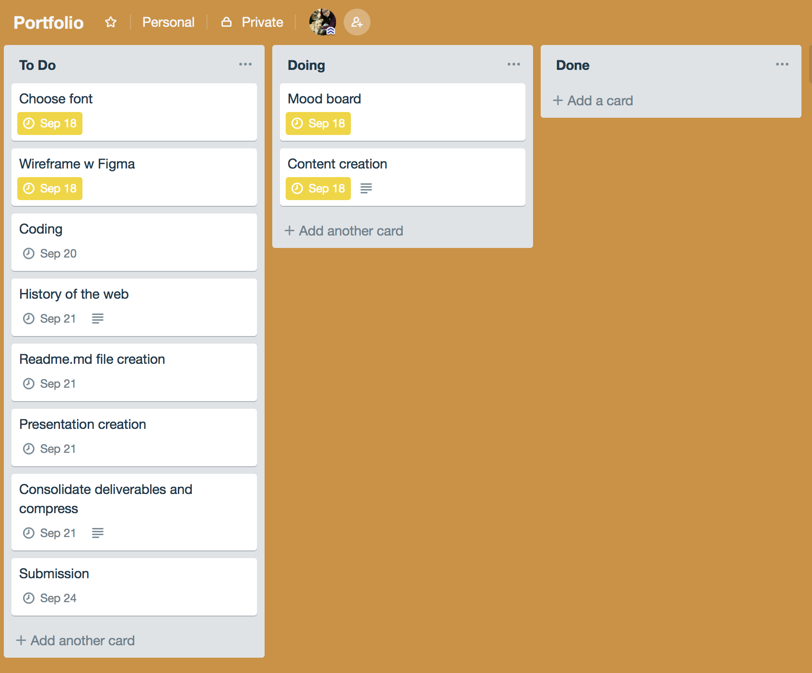
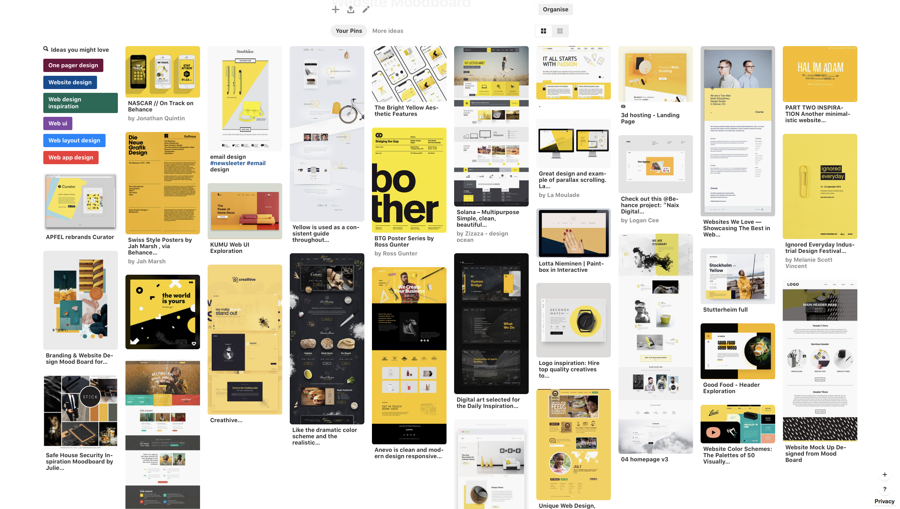

## Aitzu's portfolio website

aitzu.netlify.com

github: https://github.com/Aitzu/my-portfolio

## About the project

This is the second project from Coder Academy Fast Track Bootcamp and we have 4 days to finish this project. This is my first time to create a website so my goal was to practice what I've learnt in class as much as possible with minmalistic design. 

## Project Planning

With trello

## Inspiration - Pinterest

After playin with Pinteret for a couple of hours I realized I was in the mood for "yellow" so I decided to go with yellow and picked a few other colors that go well with it. 

## Typography

I chose Open Sans. 

## Figma board

This is the final design on Figma before I moved on to coding. 

## Coding 

I started with mobile version and apply to tablet and laptop versions in the end. In my website I used a lot of flexbox and grid and a mix of both. More than half of the time was spent on adjusting flexbox and grid and I became much more familiar with them at the end of the project. 

## Key takeaways

Don't spend too much time on design. Give it 20% of the time at most and move on to the next step. 

Content first. Finish content planning before designing so your design can serve the content better. 

Plan properly before coding.

Get the structure working before spending time on fixing small bugs. 

## Upcoming Improvements

Add a new profile picture

Add the key highlights of previous work experiences

Upgrade "get in touch" section by adding a submit form. 

## 
# Describe key events in the development of the internet from the 1980s to today (max. 150 words) 
1982: TCP/IP invented, used as the protocol for ARPANET
1990: Tim Berners-Lee invents HTML at CERN
1991: The world wide web (www) is launched by CERN
1994: Windows 95 launches with a web browser
1995: Amazon.com launches
1998: Google.com launches
2000: The dot come bubble bursts
2003: Wordpress launches
2004: Facebook launches, Firefox launches
2005: Youtube launches
2006: Twitter launches
2010: Facebook hits 400 million daily active users
2018: Amazon becomes the first trillion dollar internet Company

#Define and describes the relationship between fundamental aspects of the internet such as: domains, web servers, DNS, and web browsers (max. 150 words)

Web servers are physical and virtual devices that hold the data for websites, web apps and services. Domains are the real world names for websites that the Domain Name System (DNS) translates into IP addresses so that your web browser can find the wesbite. A web browser is a software application that translates HTML, CSS and other web languages into web pages or applications you can view and use.

#Reflect on one aspect of the development of internet technologies and how it has contributed to the world today (max. 150 words)

The internet has disrupted many industries but none more so than the music industry. Music piracy has always been around but napster launching in 1999 allowed people from all over the world to freely share and exchange their music with anyone. despite the industry doing everything they coud to shut down files-haring online this revolution lead to huge drops in physical sales and plummeting profits for record labels and the industry. But the internet has now become the biggest asset and channel for these labels, recently the rise of streaming services like youtube, spotify and others has lead to a new business model that has seen a resurgence of profits with 2017 revenues from recorded music in the United States increasing 16.5% from the previous year to $8.7 billion USD.
